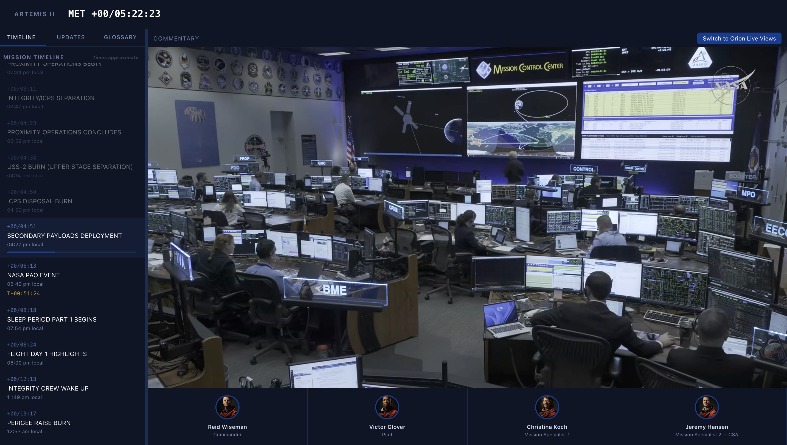

# Artemis II Mission Tracker

Real-time mission dashboard for NASA's Artemis II crewed lunar mission.

Live at: https://[your-username].github.io/artemis-ii/



## Features

- Live Mission Elapsed Time (MET) counter
- 100+ milestone timeline with progress tracking
- Crew profiles
- NASA Artemis blog RSS feed
- YouTube livestream embed
- NASA acronym glossary

## Dev

```
npm install
npm run dev      # dev server with HMR
npm run build    # production build → dist/
npm run preview  # preview production build
```

No frameworks. Vanilla JS + Vite.
